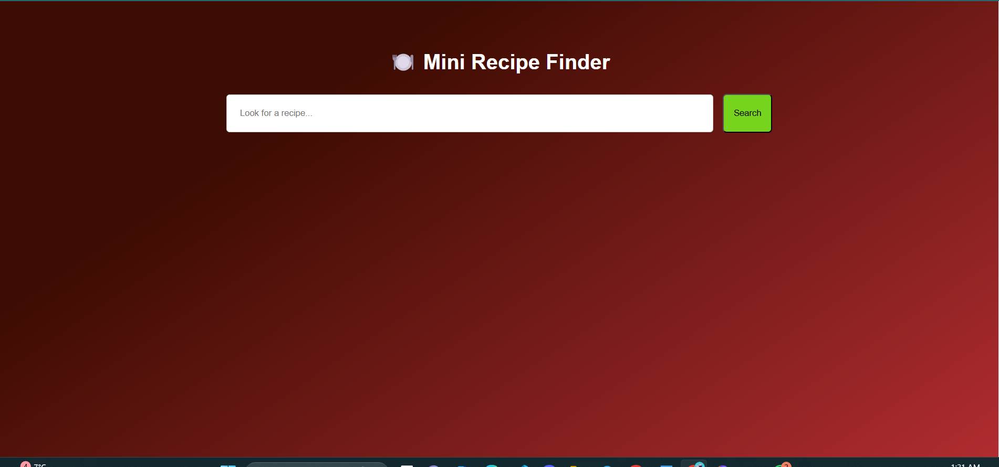

# 🍽️ Mini Recipe Finder

A responsive web app that allows users to search for meal recipes by ingredient using the free [TheMealDB API](https://www.themealdb.com/api.php). Results are displayed as interactive cards with images, categories, and links to full recipe instructions.

---

## 🔧 Built With

- **HTML5** – structure
- **CSS3** – Flexbox, media queries, gradient background
- **JavaScript (ES6+)** – DOM manipulation, fetch API, async/await

---

## ✨ Features

- 🔍 Live search for recipes by keyword or ingredient
- 🧾 Dynamic recipe cards with images, name, category, area
- 🌀 Loading spinner while fetching data
- 📱 Responsive layout for mobile + desktop
- ❌ Error message if no recipes found

---

## 🖼️ Preview

---

## 🌐 Live Demo

🔗 [View Live App](https://yourusername.github.io/mini-recipe-finder)

---

## 📁 Setup Instructions

1. Clone the repo  
   `git clone https://github.com/yourusername/mini-recipe-finder.git`
2. Open `index.html` in your browser  
   OR deploy with GitHub Pages / Netlify

---

## 🧠 What I Learned

- Working with APIs and async/await
- DOM manipulation and dynamic rendering
- Responsive layouts using Flexbox
- Writing cleaner, more maintainable JavaScript
